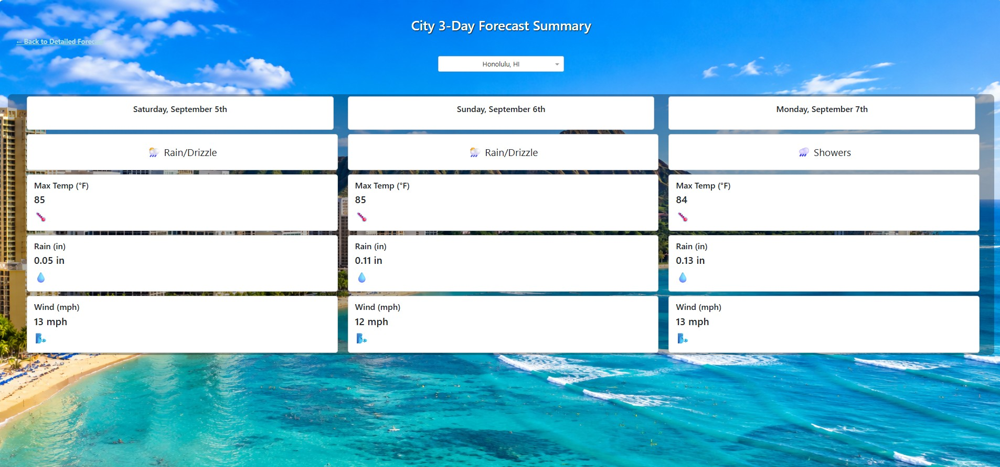
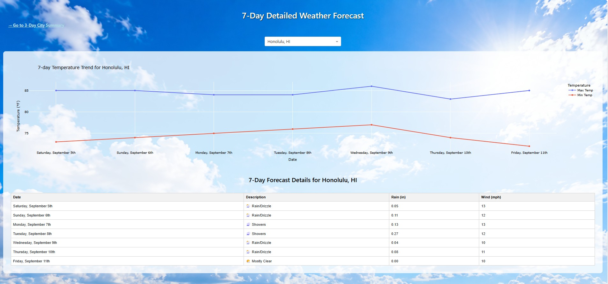

# Weather Data Pipeline & Interactive Dashboard

Python-based weather data pipeline and interactive Dash application that retrieves forecast data from the Open-Meteo API, processes and formats the results, and presents 3-day and 7-day weather forecasts for multiple U.S. cities.

## Dashboard Preview

### 3-Day City Forecast Summary



### 7-Day Detailed Weather Forecast



## Project Overview

This project demonstrates an automated workflow for retrieving, processing, and presenting weather data through an interactive web application.

The application retrieves forecast data from the Open-Meteo API for Honolulu, New York, Chicago, and San Francisco. The data is processed in Python and displayed through an interactive Dash interface with city-specific forecast summaries, temperature trends, precipitation, wind conditions, and weather descriptions.

## Key Features

- Automated weather data extraction from the Open-Meteo API
- 3-day city forecast summary
- 7-day detailed forecast
- Interactive city selection
- Plotly-based temperature visualization
- API request caching
- Retry logic for resilient API requests
- Application logging
- Local image assets
- Data processing with pandas

## Technologies

- Python
- Dash
- Plotly
- pandas
- Open-Meteo API
- requests-cache
- retry-requests
- Dash Bootstrap Components

## Project Structure

```text
weather-dashboard/
├── Assets/
├── 01_3_Day_Forecast.jpg
├── 02_7_Day_Detailed_Forecast.jpg
├── weather_dashboard.py
├── requirements.txt
├── .gitignore
└── README.md
```

## Running the Application

Install the required packages:

```bash
pip install -r requirements.txt
```

Run the application:

```bash
python weather_dashboard.py
```

Then open the local Dash address displayed in the terminal.

## Skills Demonstrated

**Python • API Integration • Data Pipelines • Data Processing • Dash • Plotly • Automation • Data Visualization**